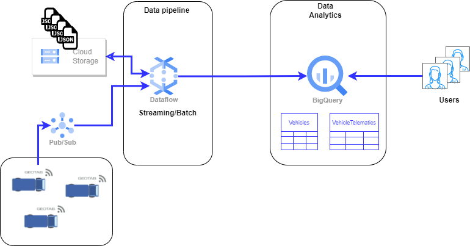

# Data Engineer Test Task
## Objectives
* Demonstrate problem solving and programming skills.
* Show data pipeline/storage/querying scalability understanding - create scalable
pipeline. 
* Understanding of performance/cost optimization - use existing tools’ features
(partitioning, caching etc) to optimize cost while fulfilling performance requirements.

We have messages in a stream representing vehicle telematics data.
200.000 messages per day, 20GB per day.

Messages are in json format:
```json
{
"vehicle_id": "XXXX",
"timestamp":"2021-04-30T10:00:00.000Z"
"location": {"lat": 23.4234, "lng":32.4242 }
"status": {...}
}
```
"status" field schema is not defined upfront (schema on read) and can change.
There're on average 1000 vehicles sending data on a single day. Some send a single
message, some sending up to 500 per day.

Also we have messages describing vehicle:
```json
{
"vehicle_id": "XXXX",
"description": {...}
}
```
"description" field schema is not defined upfront (schema on read) and can change.

At the moment we already have 1 year worth of data in the log.

We need to ingest them into some storage (files, DB etc) that we can query
afterwards. The data should be available for query after 2 hours.

## Most queries are:
* Selecting all the telematics data for a specific vehicle.
* Selecting all the telematics data for specific time range.
* Selecting all the telematics for a specific vehicle and time range.
* All of the above together with "vehicle description".

The queries are made by analysts on average 200 times/day. The queries should give
an answer in 2 minutes. 

We want to use Google Cloud managed services as much as possible.

Given the above requirements are met we want to optimize for cost.

## Your task is split into two – analysis and programming

### 1. Analysis 
Given the above situation description, choose the
storage/tools/services among google cloud offering you’d like to use and
describe:
1. What the ingestion pipeline would look like.

## Overall Pipeline Diagram



### GCP Services selected for the solution:

* GCP Storage: This service fits with the requirement to store semi-structured files such as JSON with vehicles data at a low cost.
* Pub/Sub: This service let us to gather data in streaming sent by vehicles and let possible that dataflow streaming pipeline receives
 this data to process it.
* Dataflow: This fully managed service is essential to perform data pipelines to process data in streaming and batch and its ease integration 
with another services like BigQuery. Moreover, its scalability streaming low latency and serverless approach it becomes an excelent option.
* BigQuery: This fully managed service provides some interesting features such as partitioned and clustered tables to reduce costs of executing queries over 
high amount of data by scanning only the data that meets the filters in a fine-grained way.

### Pipeline flow

1. Dataflow streaming pipeline receives data in JSON format from Pub/Sub topic and once received they are stored in a bucket.
2. Dataflow batch pipeline process the JSON files stored into GCP buckets. The JSONs with the vehicle data and telematic data has separated by folder into the same bucket (e.g. `gs://bucket_name/vehicles_data/`, `gs://bucket_name/vehicles_telematic_data/`)
3. A Dataflow pipeline read both folders and process all the JSON files, performig the below tasks:

    * Read the JSONs files from each folder.
    * Execute process to flatten the JSON's attributes.
    * Once the JSON with vehicles' data has flattened, the pipeline stores the data into the BigQuery's table `vehicles_data` inside defined dataset.
    * In the same way, the pipeline stores the telematics data into the table `vehicles_telematic_data`.

### BigQuery Tables schemas

#### vehicles_data

| vehicle_id  |description.color|description.hp|description.brand|description.mileage|
|-------------|-----------------|--------------|-----------------|-------------------|
| CDT35T99FY  |    Blank        |     500      |     Volvo       |         --        |
| CDT40T10ER  |    Blue         |      --      |     Daimier     |         350.000   |


#### vehicles_telematic_data

| vehicle_id  |      timestamp    |location.lat  | location.lng  |status.gps|status.antenna_4g|year|month|day|
|-------------|-------------------|--------------|---------------|----------|-----------------|----|-----|---|
| CDT35T99FY  |2023-09-15 15:00:01| 114.945132   |  40.400235    | CONNECTED|        --       |2019|  09 | 15|
| CDT40T10ER  |2023-09-14-22:00:05| 110.560021   |  35.135646    |   --     |    CONNECTED    |2019|  09 | 14|


2. How you perform queries listed above (that ensures given performance
criteria is met).

    * To ensure the performance of the all query executions it is recommended to partition the table `vehicles_telematic_data` by `year, month and day` 
    columns and perform clustering by `vehicle_id` column due to its high cardinality and also to perform queries filtering by `vehicle_id` and range of dates.
    * The table `vehicles_data` also might use clustering by the column `vehicle_id` used to join with the table `vehicles_telematic_data`.
    * Moreover, in the queries it is needed to perform a join with the table `vehicles_data` to extract its description attributes.
    * Therefore, using partitioning and clustering in both tables let us execute the aforementioned queries optimizing for cost:
        * Selecting all the telematics data for a specific vehicle filtering by clustered column `vehicle_id`.
        * Selecting all the telematics data for specific time range filtering by partitioned columns `year, month and day`.
        * Selecting all the telematics for a specific vehicle and time range by partitioned columns `year, month and day` and by clustered column `vehicle_id`.
        * All of the above together with "vehicle description" performing a join beetween clustered columns vehicle_id of both tables.

3. Do cost analysis (cost per month) of the proposed solution (storage and
querying, when scaled to the amount of data we have).

The cost analysis for querying and storage domains is based on the following premises:
* 1 year data stored into BigQuery has a 20GB * 365 days =  7300 GB ≈ 7.3TB ≈ 6.63TiB which it's equivalent to 0.55TiB per month.
* 200 queries are executed daily over 30% of whole data (1.98TiB) asumming that user always using filters by vehicle_id and/or range of dates.
* All the data will be stored in BigQuery using the Active Logical Storage (option by default).
* Long-term storage includes any table or table partition that has not been modified for 90 consecutive days.
* The JSON files generated in the last 90 days will be stored in Cloud Storage. 20GB * 90 days ≈ 1.63 TiB
* Costs calculated for Frankfurt (europe-west3) region.
* If each JSON file has a size ≈ 2KB
* Class A represents operations such as *.insert of JSON into Cloud Storage.
* Class B represents operations such as *.get  of JSON files stored into Cloud Storage.

### GCP Storage Costs/month


### BigQuery Storing and Query Costs/month


 

### 2. Programming
1. Create a mock data producer in TypeScript that will stream
random messages as described in schemas above to a configurable HTTP
endpoint. 
2. Make the producer production ready - meaning the endpoint might
be unresponsive or unreachable for short periods of time.